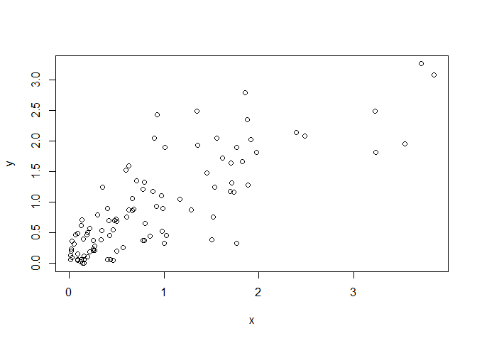

<!-- README.md is generated from README.Rmd. Please edit that file -->
MDBED
=====

<!-- badges: start -->
<!-- badges: end -->
The goal of MDBED is to provide 3D plots of the Moran-Downton bivariate Exponential distribution (BED), generate bivariate random values, and also provide values of the joint and conditional PDFs and CDFs.

Installation
------------

``` r
# Install devtools from CRAN
install.packages("MDBED")

# install.packages("devtools")
devtools::install_github("lfduquey/MDBED")
```

Example
-------

This is a basic example of two of the functions of MDBED; the rBED and the PDF\_3dPlot functions. The rBED function generates jointly Exponential random values (x,y). The required inputs are the n values to be generated, the correlation coefficient, and the scale parameters of the marginal distributions. The pairs (x,y) are plotted for a better interpretation. The PDF\_3dPlot function on the other hand builds a 3D plot of the joint PDF of the BED. The required inputs are the correlation coefficient and the scale parameters of the marginal distributions. This function also allows several characteristics of the plot to be set.

``` r
library(MDBED)
## basic example code
Data<-rBED(n=100,Betax=1,Betay=1,rho=0.85)
plot(Data[,1],Data[,2], xlab = "x", ylab = "y")
```



``` r
PDF_3dPlot(rho=0.85,Betax=1,Betay=1,GS=0.1)
```


